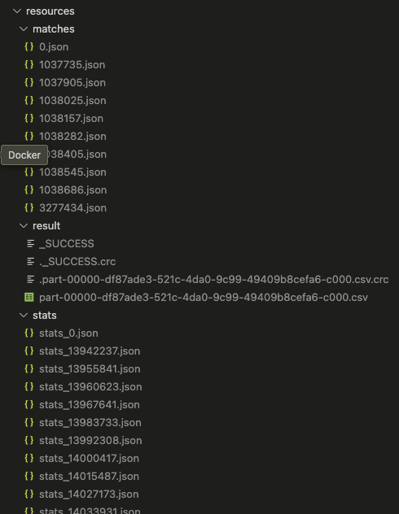

# nba_spark
Playing around with spark using the nba api

# Running 

To run the project on the root run:
1. ``` sbt compile ```
2. ``` sbt run ```
    when prompted choose 1 for extract and 2 for transform -> run extract first if the download was not done. The resulting jsons will be on resources/matches and resources/stats

    
3. ``` sbt run ``` and choose extract -> the resulting json will be on resources/result


## Results


# Requirements
Use java 8 


# Deliverables
1. [csv of the local run](resources/static_result/localRunResult.csv) -> this csv was generated when i did run on my machine
2. [extract object](src/main/scala/com.example.examspark/Extract.scala)  
3. [transform object](src/main/scala/com.example.examspark/Transform.scala) 
4. [sbt file](build.sbt) 

